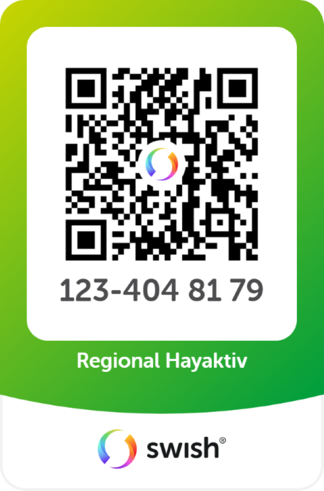

🇦🇲 Community-webb (evenemang, medlemskap & Swish)

En lätt, responsiv webbplats för en förening/Community:

Lista kommande evenemang

Ta emot anmälningar/medlemskap

Sälj/Reservera biljetter via formulär

Swish-flöde: öppna app på mobil eller visa QR på desktop

GitHub Pages-vänlig (ingen server krävs)

✨ Funktioner

Startsida med kort för nyheter, projekt/volontär och evenemang

Evenemangssektion med biljettformulär (Formspree)

Medlemskap-formulär (Formspree)

Donation/Swish: QR-bild, telefonnummer och instruktioner

Tillgängliga formulär (labels, fokusstilar)

Responsivt 2-kolumnslayout → staplar på mobil

Konfigurerbart via enkla textändringar (ingen kodkompilering)

📁 Struktur
/
├─ index.html                  # startsida (sektioner: nyheter, projekt, bli medlem, biljetter)
├─ assets/
│  ├─ css/
│  │  └─ site.css             # all stil (layout, kort, formulär, modal, QR)
│  └─ js/
│     └─ tickets.js           # Swish/Modal + Formspree för biljettformulär
└─ images/
   ├─ swish-qr-480.png
   ├─ swish-qr-720.png
   └─ swish-qr-1080.png

GitHub Pages:

User/Org-site (username.github.io) → du kan använda /assets/... och /images/...

Project-site (username.github.io/repo/) → använd relativa sökvägar assets/... och images/...

🚀 Kom igång

Formspree

Skapa två endpoints (t.ex. Medlemskap och Biljetter)

I index.html, uppdatera action="https://formspree.io/f/XXXXXXX" i respektive form.

Swish

Ange Swish-numret i texterna.

Lägg in QR-bilder i images/ (se storlekar nedan).

På mobil försöker vi öppna appen via swish://.

På desktop visas en modal med QR + instruktion.

Starta lokalt – öppna index.html i webbläsaren.

Publicera – aktivera GitHub Pages i repo-inställningarna.

🧭 Flöden
Biljetter (utan Swish Handel)

Klick på “Köp biljetter”:

Mobil: försök öppna Swish (swish://). Uteblir öppning → visa modal som fallback.

Desktop: visa modal direkt (Swish-nummer, belopp, meddelande, QR + “Öppna Swish-appen”).

Vi kan inte förifylla belopp/meddelande via länk utan Swish Handel.
Med Swish Handel kan du byta till token-länk (swish://paymentrequest?token=...) och API-genererad QR.

Medlemskap

Enkelt formulär som skickas till Formspree.

Knapparna gör inte fullbredd (för tydliga CTA-pills).

🖼️ QR-bilder (storlek)

Kvadratisk QR:
swish-qr-480.png (480×480), swish-qr-720.png (720×720), swish-qr-1080.png (1080×1080)

Poster/porträtt med QR (behåll proportioner, t.ex. 3:4):
480×640, 720×960, 1080×1440

Exempel i HTML:

🧩 Viktiga filer
index.html

Sektioner: Kommande evenemang, Projekt & volontär, Nyheter, Bli medlem, Evenemangsbiljetter

Formulär med semantiska labels, placeholders och autocomplete

Swish-modal (gömd med hidden → visas efter klick)

assets/css/site.css (några highlights)

Design-variabler (--red, --blue, --radius, --shadow)

Kort, grids och responsiv layout

Enhetlig fälthöjd (--control-h) för inputs/selects

Action-rader för knappar (hindrar “stretchade” knappar)

Modal + QR styling

assets/js/tickets.js

Validerar formulär (reportValidity)

Skickar data till Formspree med fetch

Upptäcker mobil via userAgent

Mobil: swish:// + fallback-modal om app ej öppnas

Desktop: visar modal direkt

Stänger modal via “Stäng” eller bakgrundsklick

🔒 Tillgänglighet

label > input kopplingar

Synlig fokus (via CSS :focus-visible)

Modal kan stängas med knapp och bakgrundsklick

Meningsfull alt-text för QR

🧪 Felsökning

Inget händer på desktop vid “Köp biljetter”
Kontrollera att assets/js/tickets.js laddas (DevTools → Network).
Se att ID:n matchar: #buyBtn, #swishModal, #closeModal.

QR syns inte
Kolla filnamn/sökväg (inga mellanslag), och rätt relativa länkar på GitHub Pages projekt-site.

Knapp blir fullbredd
Se att .form-actions .btn { width: auto; } och att du använder flex i action-raden.

🛠️ Anpassa

Texter & språk: uppdatera rubriker/knappar (t.ex. “Köp biljetter”, “Skicka”).

Tema: ändra CSS-variabler i :root.

Swish-flöde: visa QR inline på desktop (utöver modal) om du vill.

Fler evenemang: duplicera event-kort eller lägg en enkel JSON/MD-källa om du vill templatisera.

📦 Publicera på GitHub Pages

Push till main.

Settings → Pages
Source: Deploy from a branch → main → / (root) eller /docs.

Öppna din Pages-URL när bygget är klart.

Projekt-site: använd relativa sökvägar (assets/..., images/...).
Eget domännamn: lägg till CNAME (DNS + fil).

📄 Licens

MIT – återanvänd gärna för andra föreningar och communityn. 🙌

🙏 Tack

Byggt med fokus på enkelt underhåll, snygg typografi, säkert betalningsflöde (utan Swish Handel) och tillgänglighet från start.